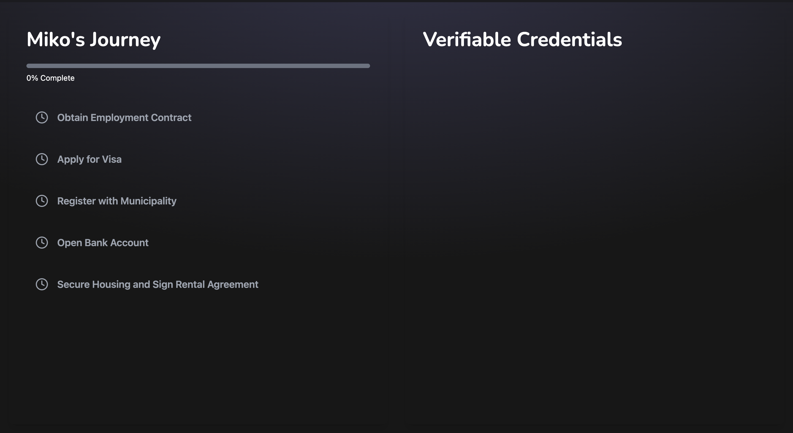
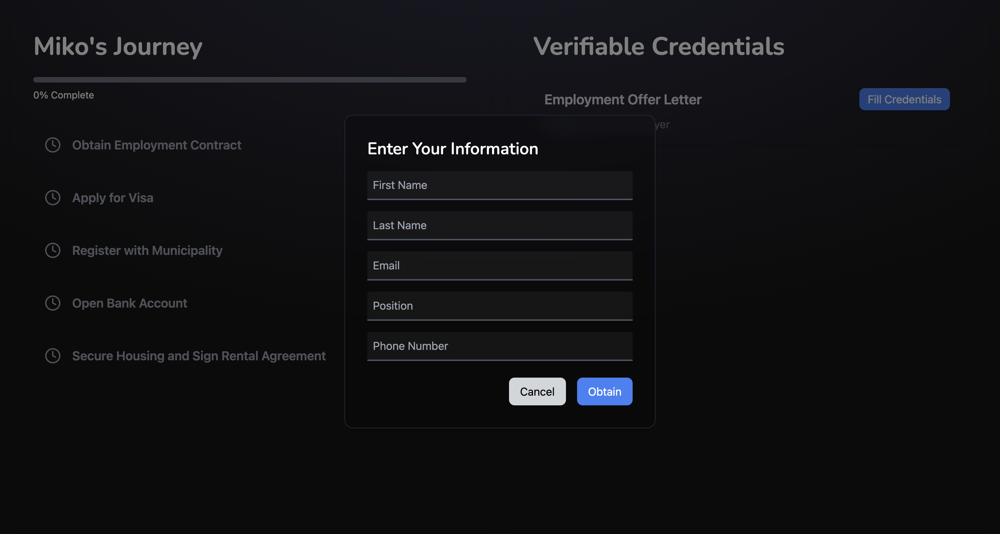
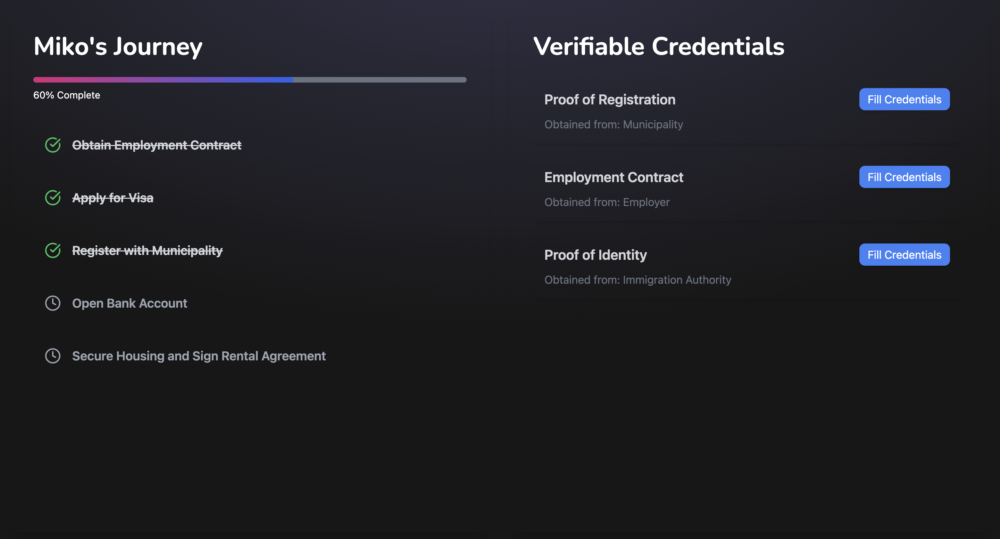
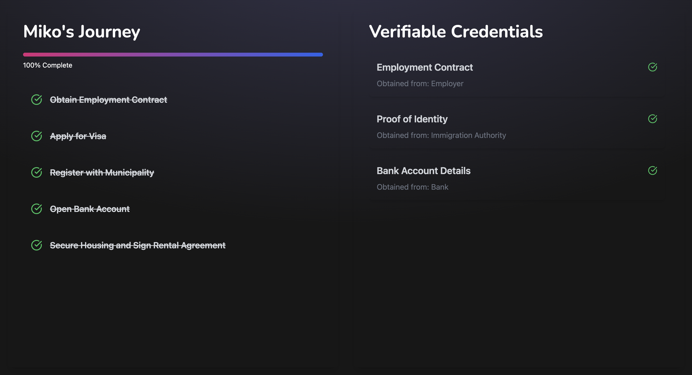

<h1><center> CredEase </h1>

## Inspiration

Our inspiration for CredEase came from the common hurdles expats encounter with legal and administrative processes when moving to a new country. Tasks such as finding housing, opening bank accounts, and registering with local authorities can be time-consuming, complex, and stressful—especially when dealing with new documentation standards. Amsterdam’s shift toward adopting Verifiable Credentials (VCs) for these processes highlighted a powerful solution to streamline and secure these tasks. CredEase was born out of this insight, aiming to be a Digital Identity Wallet that simplifies the relocation journey for expats by providing data integrity, security, and guided assistance every step of the way.

## What It Does

CredEase is a comprehensive Digital Identity Wallet with an intuitive, guided to-do list. It’s designed to assist expats in gathering, linking, and submitting Verifiable Credentials for a wide range of essential relocation tasks. Key tasks include:

- **Employment**: Collecting and linking VCs related to job offers and employment history.
- **Visa Applications**: Organizing required documents to streamline the visa application process.
- **Municipal Registration**: Facilitating local registration with linked identity credentials.
- **Bank Account Opening**: Simplifying bank KYC processes by providing verified credentials.
- **Housing**: Managing verified documents needed for leasing or purchasing property.

By automating the process of credential collection and interlinking, CredEase ensures that only verified, linked VCs are submitted to relevant entities, preserving data consistency and reducing errors or rejections.

## How We Built It

We built CredEase using the following technologies and methods:

- **Primary Language**: Developed primarily in **TypeScript**, ensuring robust and type-safe code.
- **Verifiable Credentials**: Utilized the **Truvity SDK** for handling all requests and issuing Verifiable Credentials.
- **Decentralized Identifiers (DIDs)**: Created unique DIDs by using the **Truvity Admin Panel** to generate API keys.
- **Compliance Officer Panel**: Implemented a dedicated Compliance Officer Panel that enables bank officers to review and approve Miko’s Verifiable Credentials, facilitating the issuance of additional credentials as required.

## User flow

This is the user flow of our web app

Initial form filling
</img>

Filling Credentials
</img>

Completion midway
</img>

Miko's Journey
</img>

## Challenges We Ran Into

The journey wasn’t without its challenges. Some of the significant hurdles included:

- **Understanding New Terminology**: Concepts like Decentralized Identifiers (DID), Self-Sovereign Identity (SSI), Verifiable Credentials (VC), and Verifiable Presentations (VP) were initially unfamiliar. Gaining a solid understanding of these foundational ideas took time and extensive research.
- **Backend Structure**: Our main backend file, `server.ts`, grew quite large as features were added. We made several attempts to modularize the code, but TypeScript errors made it challenging to import certain functions properly. While we’ve managed to work around some of these issues, further refactoring is planned.
- **VC Interlinking**: Properly linking various Verifiable Credentials was crucial to maintain data integrity across all processes. Ensuring this linking was smooth required extensive testing and careful implementation.
- **Multiple Interactions**: Managing credential flows and interactions between multiple issuers (e.g., employers, banks, municipal authorities) and verifiers was complex. Establishing a reliable credential chain that allowed for seamless transitions across different stages was essential for an intuitive user experience.

## Accomplishments That We’re Proud Of

- **Seamless User Flow**: We successfully created a user-friendly flow that guides expats through various relocation steps, making complex processes accessible and manageable.
- **Compliance Panel**: We’re proud to have built a secure compliance panel that allows entities to verify and approve VCs efficiently. This feature ensures that only necessary documents are shared, enhancing security and efficiency.
- **Automated To-Do List**: CredEase’s automated to-do list helps users organize and complete essential tasks without manual intervention. This feature is pivotal in reducing the stress associated with relocation and improves Miko’s experience significantly.

## What We Learned

Developing CredEase was a rich learning experience that deepened our understanding of several key areas:

- **Data Interoperability**: We discovered the critical role of interoperability in eKYC (electronic Know Your Customer) processes. Ensuring that data could be transferred smoothly between systems was foundational to our project’s success.
- **Hands-On with Verifiable Credentials**: Working directly with VCs provided us with hands-on insights into their structure and functionality, improving our ability to design secure, user-centered applications.
- **Self-Sovereign Identity Systems**: Our understanding of Self-Sovereign Identity (SSI) grew as we designed CredEase, helping us appreciate the potential of decentralized identity management in creating secure, user-controlled data systems.

## What’s Next for CredEase

Looking ahead, we have exciting plans to expand and refine CredEase:

- **Expansion to New Cities**: As we continue development, we hope to roll out CredEase in other expat-friendly cities, tailoring it to local requirements.
- **AI Integration**: We aim to incorporate AI to automate the verification of Verifiable Credentials, further reducing the need for manual oversight and speeding up approvals.
- **Mobile Application**: A mobile app version of CredEase would enable expats to manage their VCs on the go, making the process even more accessible.
- **Multi-Language Support**: To reach a broader audience, we plan to introduce multi-language support, helping expats from diverse backgrounds navigate relocation tasks in their preferred language.

CredEase is more than a digital wallet—it’s a companion for anyone navigating the complexities of relocation, turning a daunting process into a guided, secure, and efficient journey.

## Local working

To try the code on your local machine you can do as following , Please raise issues if any concern

```
git clone https://github.com/kirat79/Miko-s-journey-.git

# to run the backend
cd Backend
npm i
npm run start1

# to run the frontend
cd Frontend
npm i
npm run dev

```
